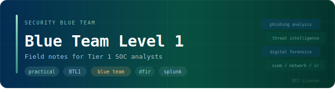

<p align="center">
  
</p>

---

A working reference built around the five BTL1 domains. Cheat sheets, detection workflows, CLI references, and investigation notes — written for use during active lab sessions, not for passive reading before an exam.

If you're mid-investigation and need a filter, a query pattern, or a quick artifact reference, this is the place to grep.

---

## Domains

<table>
  <thead>
    <tr>
      <th>Domain</th>
      <th>What's covered</th>
    </tr>
  </thead>
  <tbody>
    <tr>
      <td><strong><a href="01_Phishing_Analysis/">Phishing Analysis</a></strong></td>
      <td>Where most incidents begin. Header inspection, sender authentication analysis, URL pivoting, attachment triage, and extraction workflows.</td>
    </tr>
    <tr>
      <td><a href="02_Threat_Intelligence/">Threat Intelligence</a></td>
      <td>IOC enrichment, TTP mapping to MITRE ATT&CK, adversary profiling, pivot techniques.</td>
    </tr>
    <tr>
      <td><a href="03_Digital_Forensics/">Digital Forensics</a></td>
      <td>Disk and memory analysis — NTFS artifacts, registry hives, file carving, Volatility module reference.</td>
    </tr>
    <tr>
      <td><a href="04_SIEM_Analysis/">SIEM Analysis</a></td>
      <td>Log correlation, SPL query patterns, ECS field mapping, detection logic for common attack scenarios.</td>
    </tr>
    <tr>
      <td><a href="05_Network_Analysis/">Network Analysis</a></td>
      <td>PCAP inspection, BPF filters, protocol anomaly detection, C2 traffic patterns.</td>
    </tr>
    <tr>
      <td><a href="06_Incident_Response/">Incident Response</a></td>
      <td>IR lifecycle, live triage commands for Windows and Linux, containment and eradication steps.</td>
    </tr>
  </tbody>
</table>

---

## Repository layout
```text
.
├── 00_Introduction_BTL1/   # exam format, philosophy, strategy, personal experience
├── 01_Phishing_Analysis/   # header analysis, attachment triage, detection workflows
├── 02_Threat_Intelligence/ # IOC management, ATT&CK TTP mapping
├── 03_Digital_Forensics/
│   ├── 02_Disk_Analysis/   # NTFS artifacts, registry hives, file carving
│   └── 03_Memory_Analysis/ # Volatility profiles, injection detection
├── 04_SIEM_Analysis/       # SPL query structures, log correlation rules
├── 05_Network_Analysis/    # BPF filters, protocol anomalies, PCAP carving
└── 06_Incident_Response/   # IR lifecycle, containment, live response
```

---

## Searching locally

Everything is plain Markdown. Clone once and grep during lab sessions — no setup, no dependencies.
```bash
git clone https://github.com/Nervi0z/btl1-field-notes
cd btl1-field-notes
```
```bash
# search by Windows Event ID
grep -rnw . -e 'EventCode=4624'

# find Volatility 3 module syntax
grep -rnw 03_Digital_Forensics/ -e 'windows.malfind'

# look up SPL patterns
grep -rnw 04_SIEM_Analysis/ -e 'stats count by'

# search across phishing references
grep -rnw 01_Phishing_Analysis/ -e 'Return-Path'
```

---

## Start here

> New to BTL1 or building your foundations?
> Start with **[00_Introduction_BTL1/](00_Introduction_BTL1/)** — exam format, investigation philosophy, time management strategy, and a first-hand account of the 24-hour challenge including how a manual review appeal took the result from 80% to a Gold Coin.

---

## Contributing

Corrected syntax, updated tool references, and new query patterns are welcome. Read `CONTRIBUTING.md` before opening a PR.
```bash
git checkout -b fix/spl-execution-queries
git commit -m "siem: update sysmon execution detection rules"
git push origin fix/spl-execution-queries
```

<details>
<summary>Content scope and NDA notice</summary>

This repository contains general technical documentation and open-source tool references only.

No proprietary BTL1 exam content, lab infrastructure details, or restricted Security Blue Team materials are included or will be accepted — in compliance with SBT NDA terms. Pull requests containing such material will be closed without review.

</details>

---

MIT License · See `LICENSE` for details.
